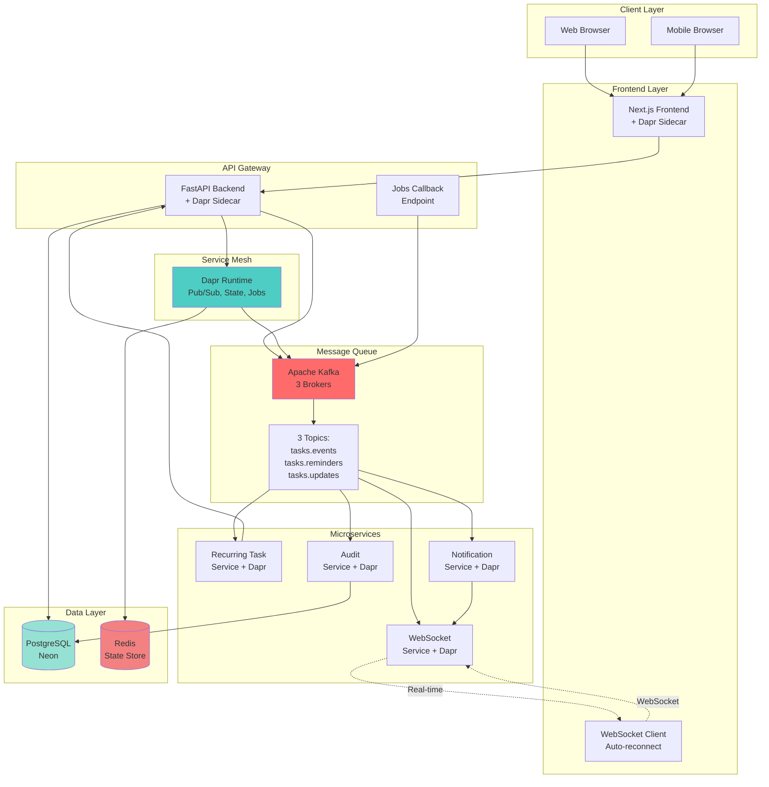
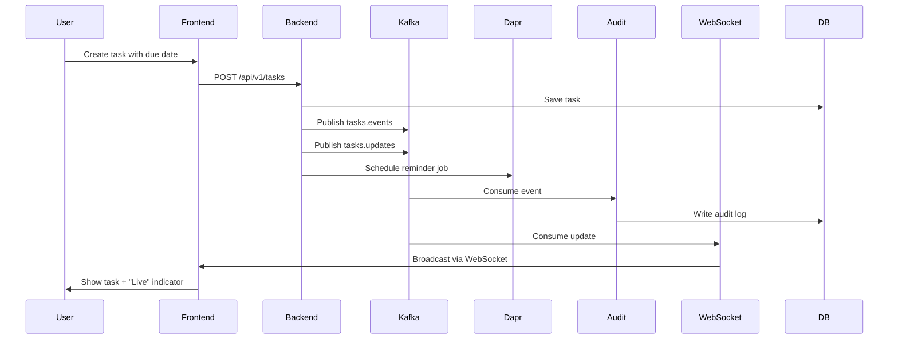
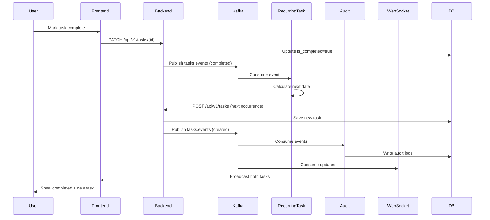
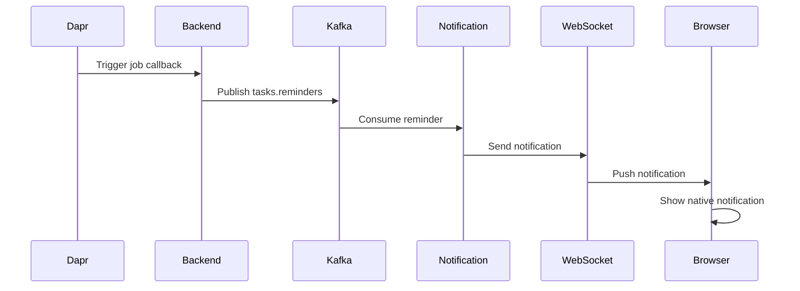
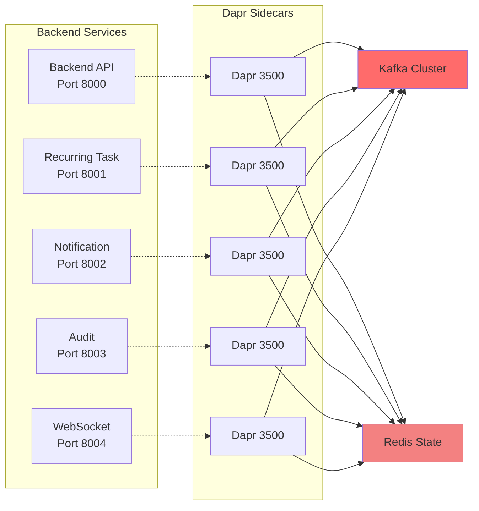
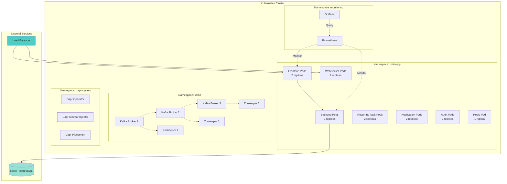
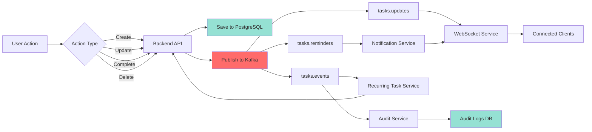

# Phase V Architecture

## System Architecture

## Event Flow Diagrams

### 1. Create Task with Reminder

### 2. Complete Recurring Task

### 3. Reminder Notification

## Component Architecture

## Deployment Architecture

## Data Flow

